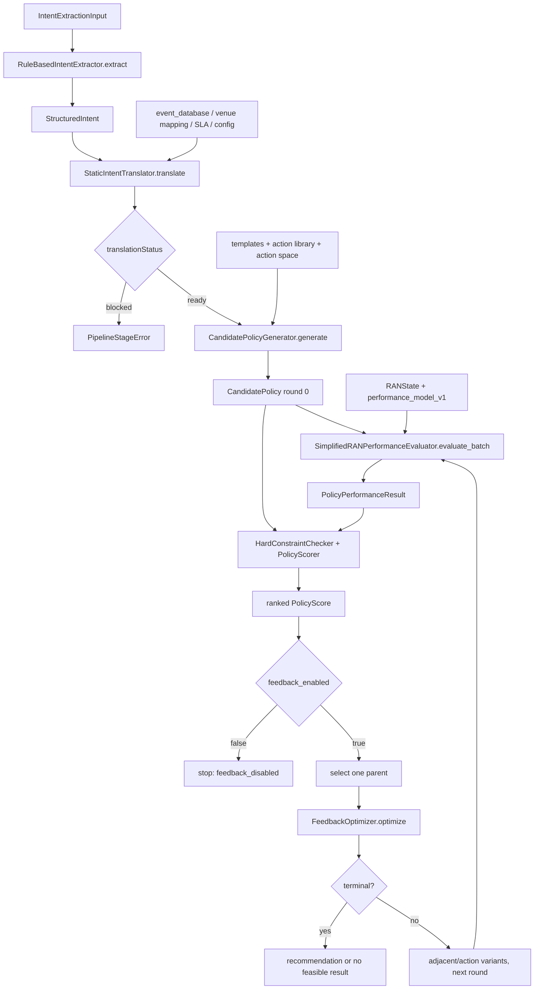

# ran-intent-simulation ??????????

## 1. ???????

??????? `src/ran_intent_simulation/` ???????????? `simulation_requirements.md` ? `C:/Users/SYE/Desktop/?3?.tex` ??????????????? v0.1.1 ??? RAN ???????????????????????????????UPF?????????????????????????????????

?????????

`RuleBasedIntentExtractor` ? `StaticIntentTranslator` ? `CandidatePolicyGenerator` ? `SimplifiedRANPerformanceEvaluator` ? `HardConstraintChecker`/`PolicyScorer` ? `FeedbackOptimizer`?

????????????????RAN ???????????????????????????????????????????????????????????????????

## 2. ????

### 2.1 ????????????

- ?????`src/ran_intent_simulation/intent/base.py` ? `IntentExtractor.extract()`?
- ?????`src/ran_intent_simulation/intent/rule_based.py` ? `RuleBasedIntentExtractor.extract()`?
- ???`models/intent.py::IntentExtractionInput`???? `intentId`??? `originalText`???? `requestTime` ??? `context`?
- ???`models/intent.py::StructuredIntent`??? `schemaVersion`?`intentId`?`originalText`???? `intentTypes`?`extractedSemantics`?`semanticRelations`?`logicalRelations`?`unresolvedItems` ???? `extractionMethod=rule_based_v1`?
- ?? `SemanticSlot` ???? `rawText`?`normalizedValue`?`source`?`confidence`?????? `UnresolvedItem(code, severity)` ???

### 2.2 ???????

?????????????????????????????????

1. ????????????????
2. ????????????????????????????????????????????
3. ??????????????
   - `service_assurance`????????????????????
   - `energy_optimization`?????/???????
   - `service_protection`?????????????
4. ????????????? `UnsupportedIntentError`?
5. ????????????????????????????????????????????
6. ?? `assure`?`minimize`?`protect`?`temporal_scope`?`spatial_scope` ???????????????????????????????????????????
7. ???? `code` ???????

????????????????????? `stadium`???????? `video_users`???????? `uplink_video`???????? `minimize_ran_energy`????????????????? `simulation_config.yaml::intent_extraction.confidence` ??????????????

### 2.3 ??????????????

????????????? RAN ????????????????? `exact_time_period` ? `ran_scope`??????????????????????????????????????????????????????????????????????

???????????????????????????????????????????????????????????BERT/NER?LLM???????? API ???????

### 2.4 ??????????

???? `config/simulation_config.yaml` ???? Schema ??????????????????????? `rule_based.py` ???????????????

`tests/unit/test_intent_extraction.py` ??????????????????????????????????????`test_intent_models.py` ??????????????`tests/integration/test_pipeline.py` ???????????????????

### 2.5 ??????????

???? 3.2 ?????????????/???????????????????????????????????????????????????????????????/????/???????????????????????????????????????? NLP/NER ??????????????????

## 3. ??????

### 3.1 ????????????

- ?????`translation/translator.py::IntentTranslator.translate()`?
- ?????`translation/translator.py::StaticIntentTranslator`???????? `from_configuration_refs()`?
- ?????`EventRepository`?`VenueCellMappingRepository`?`SLATemplateRepository` ????? `StaticTranslationRepositories`??? `translation/repositories.py`?
- ???`IntentTranslationInput(structuredIntent, configurationRefs)`?
- ???`TranslatedRANIntent`????????? `scope`?`ranObjectives`?`slaConstraints`?`objectiveRelationship`??? `unresolvedItems` ? `translationStatus`?
- `scope` ????????/?????`venueId`?`gnbIds`??? `cellId`?`carrierIds`???????????

### 3.2 ???????

1. ???????????????????????? RAN ?????
2. ?????????????????????????????????????? `event_type=concert`???????????????
3. ???????? `startTime/endTime` ? `venueId`????????????? `time.pre_effective_minutes`?`time.post_effective_minutes`?
4. ????? `venueId` ?????????? Pydantic ??????????????????????
5. ??????????????????? `uplink_video`??????? `voice`?
6. ?? RAN ?????????? `primary`???? `secondary`?????? `mandatory`?
7. ???? `concert_uplink_assurance` SLA ?????????????????????????? P95 ?????????????????????PRB ???????
8. ????????????????????????????? `unresolvedItems`????? blocking ?????? `blocked`???? `ready`?

?????????????? `event_database`?`venue_cell_mapping`?`sla_template:<version>` ? `structured_intent`?

### 3.3 ?????????????

- `data/event_database.json`??????????????
- `data/venue_cell_mapping.json`???? gNB/??/????????
- `config/sla_templates.json`?????????????????????
- `config/simulation_config.yaml`??????SLA ??? PRB ??????? `thresholdRef` ??????????????

??????????????????????????????/????????????????????????SLA ???????? `translationStatus=blocked`??????????? ML?LLM?RL?GIS ???????

### 3.4 ????????????

`tests/unit/test_intent_translation.py` ?????????????/??/SLA?????????????????????????? JSON ???????????? `test_translation_models.py`?`test_loaders_validators.py` ????????????????????????

???? 3.3 ???????SLA??????????????????????????????????????????? GIS/??????????????????????????????????????????????????????????????SLA ??????? `concert_uplink_assurance`?????????????????????

## 4. ??????

### 4.1 ??????????

- ???`policy/templates.py::PolicyTemplate` ? `build_policy_templates()`?
- ?????`policy/constraints.py::StaticPolicyConstraintChecker.check()`?
- ?????`policy/generator.py::CandidatePolicyGenerator.generate()`?
- ?????? `TranslatedRANIntent`??? `generation_round` ? `parent_policy_id` ??????????????? `RANState`?
- ???`PolicyGenerationResult`??? `policies`?`generatedCount`?`filteredCount`??????? `filteredReasonCounts`?`retainedCount` ? `generationRound`?
- ?? `CandidatePolicy` ?? ID??? ID????????????????????????/?????????????????????????

### 4.2 ????

??? `(priority, templateId)` ?????

| ?? | ?? | ???? |
|---|---|---|
| ?? | `baseline` | ??? |
| ????? | `scheduling_assurance` | ????????????????????? |
| ????? | `resource_assurance` | UL PRB ??????????????????? |
| ????? | `joint_assurance` | UL PRB ?? + ??????????????????? |
| ???????????? | `voice_protection` | ???? |
| ????????? | ??????? `_with_energy` ?? | ????? + RAN ?? |
| ????????? | `energy_optimization` | RAN ?? |

??????????????????? `r=0,w=1,v=0,e=0` ?????????????????? 0?

### 4.3 ???????????????

??????????????????????? `action_library.json` ? `valueSetRef` ?? `simulation_config.yaml` ??????????????????????? `itertools.product(*value_sets)`???????????????

- `reservedPrbRatio`: `action_space.reserved_prb_ratio`?
- `videoSchedulingWeight`: `action_space.video_scheduling_weight`?
- `minimumVoicePrbRatio`: `action_space.minimum_voice_prb_ratio`?
- `energySavingIntensity`: `energy.saving_intensity_values`?

????????????????????????????????????? Schema ????????????????????????????????????

\[
r+v\le u_{\max},
\]

?? `r=reservedPrbRatio`?`v=minimumVoicePrbRatio`?`u_max=resources.maximum_prb_utilization`?????????????????????????????????????? PRB ??????????????

?????????? `(type, target, sorted(parameters))` ???????????????????? ID??????????????????????????? ID ??????????`RAN-POLICY-R<round>-<index>`?????

?? `generation.maximum_candidates_per_round` ??????????????? N ?????????? `maximum_candidates_per_round`???????????????????

### 4.4 ????????????

?????????????????????????????????????????????????????????????????????????? SLA ???

`translationStatus!=ready`?? scope???????????????????????????? `PolicyGenerationError`/???????`tests/unit/test_policy_generation.py` ????????????????????????/???????????????PRB ?????????? SLA ???????????????? `test_policy_models.py` ???

### 4.5 ?????????

????????????????????????????? 3.4 ????????????????????????????????????????????????????

??????????????????????????? RAN ????????????????????????????? 11.5 ????????????????????????????????????????????? 11.6 ????? `SearchSpace` ??? `PolicyFeedback[]` ???????????????????

## 5. ???????????

### 5.1 ???????

- ???????`performance/base.py::RANPerformanceEvaluator`?
- ?????`performance/simplified_ran.py::SimplifiedRANPerformanceEvaluator`???? `evaluate()`/`evaluate_batch()`?
- ????`scoring/constraints.py::HardConstraintChecker.check()`?
- ????`scoring/normalization.py::normalize_metric()`?`normalize_gain()`?`normalize_cost()`?
- ?????`scoring/scorer.py::PolicyScorer.score_and_rank()`?
- ???`feedback/optimizer.py::FeedbackOptimizer.optimize()`?
- ???`pipeline.py::RANIntentSimulationPipeline.run()`?

???? `PerformanceEvaluationInput` ?? `RANState`?`CandidatePolicy` ???????? `PolicyPerformanceResult` ????????????????????PRB???????????????/??????????????? `PolicyScore` ??????????????????????????????????????? `FeedbackOptimizationResult` ?? `PolicyFeedback`????????????????????

### 5.2 SimplifiedRANPerformanceEvaluator ?????

?????? PRB ?? `r`??????? `w`????? PRB ?? `v`????? `e`??????? `performance_model.neutral_parameters`???? PRB ???? `u_0`???????

\[
\phi=\operatorname{clip}(1-k_E e,\phi_{\min},1),\qquad
u'=\operatorname{clip}\left(\frac{u_0+k_r r+k_v v}{\phi},0,1\right),
\]

\[
o=\max(0,u'-u_{\mathrm{cong}}).
\]

??????? `i` ?????

\[
f_i^{\mathrm{SINR}}=\operatorname{clip}\left(1+k_s(\gamma_i-\gamma_{\mathrm{ref}}),f_{\min},f_{\max}\right),
\]

\[
B_i'=\operatorname{clip}\left[B_i^0+\chi_u o-\chi_r r-\chi_w(w-1),0,1\right].
\]

??????????????????

\[
T_i'=\operatorname{clip}\left(
T_i^0(1+\alpha_r r+\alpha_w(w-1))\phi
\frac{f_i^{\mathrm{SINR}}}{1+\alpha_c o},T_{\min},T_{\max}
\right),
\]

\[
D_i'=\operatorname{clip}\left(
D_i^0\frac{1+\beta_u\max(0,u'-u_0)+\beta_e e}
{1+\beta_r r+\beta_w(w-1)},D_{\min},D_{\max}
\right).
\]

?????????? `epsilon`??????

????????????????

\[
Q'=\operatorname{clip}(Q_0+\delta_vv-\delta_rr-\delta_ee-\delta_uo,0,1),
\]

\[
\Delta Q_{\mathrm{voice}}=\operatorname{clip}(\max(0,Q_0-Q'),0,1),
\]

\[
E'=\operatorname{clip}\left[E_0\left(1-\eta_e e+\eta_u\max(0,u'-u_0)+\eta_aN_{\mathrm{highcost}}\right),E_{\min},E_{\max}\right],
\]

\[
\Delta Q_{\mathrm{normal}}'=\operatorname{clip}\left(
\zeta_rr+\zeta_w(w-1)+\zeta_vv+\zeta_ee+\zeta_u\max(0,u'-u_0),0,1\right).
\]

`N_highcost` ? `action_library.json::isHighCostAction` ???????? Python ?????

????????? `[0,1]`?

\[
R_u=\operatorname{clip}\frac{u'-u_{\mathrm{cong}}}{1-u_{\mathrm{cong}}},
\quad
R_{q,a}=\operatorname{clip}\frac{Q_{\min}+m-Q'}{m},
\]

\[
R_{q,b}=\operatorname{clip}\frac{\Delta Q_{\mathrm{voice}}}{\max(\Delta Q_{\max},\epsilon)},
\quad R_q=\max(R_{q,a},R_{q,b}),
\]

\[
R_e=\operatorname{clip}\frac{e}{\max(e_{\mathrm{configured}},\epsilon)},
\quad R_a=\operatorname{clip}\frac{N_{\mathrm{active}}}{N_{\max}},
\]

\[
R_f=\operatorname{clip}\frac{\Delta Q_{\mathrm{normal}}'-\theta_f}{1-\theta_f},
\quad
R_b=\operatorname{clip}\frac{\max(0,\bar B'-\bar B_0)}{s_b}.
\]

????????? `max(0,...)` ??????????????????????????

\[
R=\operatorname{clip}(\omega_uR_u+\omega_qR_q+\omega_eR_e+
\omega_aR_a+\omega_fR_f+\omega_bR_b,0,1).
\]

????????????????????? `config/performance_model_v1.yaml` ? `simulation_config.yaml`????? `simulation_assumption`??????????? 3GPP ???

### 5.3 ????????????

??????????? BLER ??? NumPy ??????????????????? `statistics.throughput_low_quantile`?`statistics.delay_high_quantile`??? `statistics.quantile_method` ???? `numpy.quantile`?????????? `T_i' >= sla.video.throughput_threshold_mbps` ?????????????

???????????? `rawValue`?`clippedValue`?`wasClipped`?????????????????????????????????????? INFO ???????????? WARNING??????????????????????????? ERROR ???????????????????????? `modelWarning`?

?????????????????????????`stochastic_enabled=false`?????????????????????????????????????????????????????????????????????????????????????

### 5.4 ????????????

`HardConstraintChecker` ????????? `hardConstraints`????????? `thresholdRef` ??????????????????

- `videoUserSatisfactionRatio >= 0.95`???????????? 20 Mbps?
- `videoDelayP95Ms <= 30`?
- `voiceQualityScore >= 0.95`?
- `voiceQualityDegradation <= 0.02`?
- `prbUtilization <= 0.90`?

????????????P05 ???? BLER ????/?????????????????????????????????????????????????????????? `totalScore=0`?`rank=null`?????????????????

?????????

\[
N_g(x)=\operatorname{clip}\frac{x-x_{\min}}{x_{\max}-x_{\min}},\qquad
N_c(x)=1-N_g(x).
\]

?? gain ?????????cost ????????????? `scoring.normalization_bounds`????????

?????????

\[
S_{service}=0.35N_g(\rho_T)+0.20N_g(T_{P05})+
0.20N_c(D_{P95})+0.10N_c(\bar B)+0.15N_g(Q'),
\]

\[
S_{energy}=N_g((E_{baseline}-E')/E_{baseline}),
\]

\[
S_{resource}=0.80N_c(u')+0.20N_c(N_{actions}),
\qquad S_{risk}=N_c(R).
\]

????????

\[
S=\operatorname{clip}(0.60S_{service}+0.15S_{energy}+
0.15S_{resource}+0.10S_{risk},0,1).
\]

???????????? Pydantic ???? 1?

### 5.5 ???????

??????????????????

`(-round(totalScore, 12), prbUtilization, performance.riskScore, ranEnergy, actionCount, policyId)`?

?????? `scoring.tie_break_order` ????????????????????????? `policyId` ??????????????????????????????PRB???????????ID ???

????? 13.3 ???????????????????????????????????????????????????????

### 5.6 feedback_enabled ?????

`feedback_enabled=false` ????????? 0 ??????????????????????????????????? `FeedbackOptimizer`????????? `feedback.json`???????manifest ?? `feedbackEnabled=false`?`feedbackIterations=0`?`generationRounds=1`?`terminationReason=feedback_disabled`??? `generationRounds=1` ???????????????????? `generationRound=0`?

`feedback_enabled=true` ???????????????????????? `rank=1`???????????? `serviceScore`?`resourceScore`?`riskScore`?????? PRB ??? ID???????????????? `continue` ???????

### 5.7 ????????????????

??????????????

| ???? | ???? |
|---|---|
| ????????? P05 ?????????? | `r` ????`w` ??? |
| P95 ???? | `w` ????`r` ??? |
| ????????????? | `v` ????`r` ????`e` ??? |
| PRB ?? | `r` ???????????????????????????????? |
| ????????????? | `e` ????`r` ??? |
| ??????????? | `r`?`w` ???? |
| BLER ?????? 0 | `e`?`r` ???? |
| ?????????? | ??????????????? `ran_energy_optimization` ?? |

??/???????????????/????????????????????????????????????????????????????????????????????????????????????????????????

???? `parentPolicyId`??? `generationRound` ? `generationReason=feedback:<reason>:<operation>`????????? JSON ? SHA-256 ???ID ? `RAN-POLICY-R<round>-FB-<signature-prefix>`?????????????????????????????/???????????????????????????????????????????????????????????????

??????????????/???????????????? `allow_expand_action_space` ?????????????????????Top-K ?????????????????????????????????????

?????????????? `score_threshold`??? `convergence_rounds` ?????? `minimum_score_improvement`??? `maximum_feedback_iterations`?????????????????????????? `allow_relax_hard_constraints=true`?

### 5.8 ??????????

??????????????????????????/???????????????????????????????/???????????????????????????????????????????????????????????? ID ??????????????????????????????????/???/BLER????????????????????????/????????????CLI ??????

?????????????????????????????????????????/?????????? ID ???????????/???/??????????????????? ID/??/??????????????????????????????

???????????????????????????????????????????????????????????????????????????????????

## 6. ?????/?????

### 6.1 ???

- ???????????????????RAN ????????????????????????
- ??????????????????????????????????????????
- ??????????????? SLA ?????????????????
- ???????????????????????????????? ID????? SLA ?????
- ??????????????/P05/P95/?????BLER ??????????????
- ???????????????? 0 ??????????????????
- ??????????????????????? PRB ????
- ????? API?ML?DL?LLM?RL?????????????????UPF???????????

### 6.2 ?????

- ????/??????????????????????????????
- ????????? `isHighCostAction` ????????????????? ID?
- ?????????????????????? `policyId` ?????
- `feedback_enabled` ??????? Round 0 ?????????? `true`?
- ?????????????????????????????????

### 6.3 ????

- ????????? NLP/NER??????LLM???????????
- ????????? GIS/??????????????? SLA/???????
- ?????????? RAN ?????????????
- `UL_POWER_CONTROL`?`LOAD_BALANCING`?`CARRIER_SLEEP`??????????????????????
- ?? `SearchSpace`/`PolicyFeedback[]` ?????????Top-K ???????????????????????????
- ????????????????????????
- ????????????????????????
- ?????????????????? `stochasticEnabled`?

### 6.4 ???????

1. ??/???? `RANState` ?????????`CandidatePolicyGenerator.generate()` ???????
2. ??? 11.5 ???????????????????????????/???????? N ??
3. ??? 13.3 ???????????????????????????????
4. ??? 11.6?14.5 ??????????????????Top-K ????????????????????????????????
5. ????????????? `simulation_config.yaml`??????????????? `performance_model_v1.yaml`?????????????????????????????????????????????
6. ???????????? RAN ?????????????????????????????

## ?? A????????



## ?? B???????????

| ?? | ???/?? | ?? |
|---|---|---|
| `intent/base.py` | `IntentExtractor.extract` | ??????? |
| `intent/rule_based.py` | `RuleBasedIntentExtractor.extract` | ??/???????????????? |
| `models/intent.py` | `IntentExtractionInput`, `StructuredIntent` ? | ?????? Schema |
| `translation/repositories.py` | ?? Repository?`StaticTranslationRepositories` | ?????????? |
| `translation/translator.py` | `StaticIntentTranslator.translate` | ??/??/??/??/SLA ?? |
| `models/translation.py` | `IntentTranslationInput`, `TranslatedRANIntent` ? | ?? Schema ?????? |
| `policy/templates.py` | `build_policy_templates` | ????????? |
| `policy/constraints.py` | `StaticPolicyConstraintChecker.check` | ?????????????????? |
| `policy/generator.py` | `CandidatePolicyGenerator.generate` | ????????????? ID |
| `models/policy.py` | `CandidatePolicy`, `ActionLibrary`, `PolicyGenerationResult` | ?????? Schema |
| `performance/base.py` | `RANPerformanceEvaluator` | ????/??????????? |
| `performance/simplified_ran.py` | `SimplifiedRANPerformanceEvaluator` | ?????????????? |
| `scoring/constraints.py` | `HardConstraintChecker.check` | ??????? |
| `scoring/normalization.py` | `normalize_metric/gain/cost` | ??????? |
| `scoring/scorer.py` | `PolicyScorer.score_and_rank` | ?????????????? |
| `feedback/optimizer.py` | `FeedbackOptimizer.optimize` | ????????/????????? |
| `models/evaluation.py` | ????????????? | ???????? |
| `pipeline.py` | `RANIntentSimulationPipeline.run` | ?????????????????? |

## ?? C????????????

| ??/?? | ???? |
|---|---|
| `intent_extraction.*` | ?? Schema?????????? |
| `time.pre/post_effective_minutes` | ???????? |
| `event_database.json` | ?????????? |
| `venue_cell_mapping.json` | ????? RAN ???? |
| `sla_templates.json` | ????????????? |
| `sla.video.*`, `sla.voice.*` | ????????????/????? |
| `resources.maximum_prb_utilization` | ????????????? PRB ??? |
| `action_space.*`, `energy.saving_intensity_values` | ??????????? |
| `action_library.json::targetType/conflicts` | ????????? |
| `action_library.json::isHighCostAction` | ???????? PRB ?????? |
| `generation.maximum_candidates_per_round` | ????????????? |
| `statistics.*quantile*` | ?????? P05/P95 ????? NumPy ?? |
| `performance_model.config_file/version` | ??????????????? |
| `performance_model_v1.yaml::coefficients` | ?????????BLER??????????????? |
| `performance_model_v1.yaml::output_bounds` | ????/?????? |
| `performance_model_v1.yaml::clipping_monitor` | ???????? |
| `risk.*` | BLER ?????????????? |
| `scoring.normalization_bounds` | ?????????? |
| `scoring.service_weights/resource_weights/weights` | ???????? |
| `scoring.tie_break_order` | ??????????? |
| `optimization.feedback_enabled` | ????? Round 0 |
| `optimization.score_threshold` | ???????? |
| `optimization.convergence_*` | ???????? |
| `optimization.maximum_feedback_iterations` | ?????????? |
| `optimization.allow_disable_energy_objective` | ??????????? |
| `optimization.allow_relax_hard_constraints` | ??? false???????? |
| `optimization.allow_expand_action_space` | ??????????????? |
| `reproducibility.random_seed` | ???????????????? |

## ?? D???????????

| ??/?? | ???? |
|---|---|
| ???? `phi`???? PRB???? | `performance/simplified_ran.py:152-168` |
| ?? SINR ?????? | `performance/simplified_ran.py:174-194` |
| ???? | `performance/simplified_ran.py:196-213` |
| ?? BLER | `performance/simplified_ran.py:215-235` |
| ???P05?P95????? | `performance/simplified_ran.py:253-278` |
| ????????? | `performance/simplified_ran.py:309-328` |
| RAN ????????? | `performance/simplified_ran.py:330-343` |
| ???????? | `performance/simplified_ran.py:345-358` |
| ???????? | `performance/simplified_ran.py:527-578` |
| ????? | `performance/simplified_ran.py:380-394` |
| ???? gain/cost ??? | `scoring/normalization.py:15-39` |
| ??????? | `scoring/constraints.py:41-112` |
| ??/??/??/???????? | `scoring/scorer.py:63-120` |
| ????? | `scoring/scorer.py:172-187` |
| ??????? | `policy/templates.py:20-93`, `policy/generator.py:143-185` |
| ??????????? | `policy/constraints.py:43-143` |
| ???? | `feedback/optimizer.py:232-518` |
| ?????? | `feedback/optimizer.py:607-700` |
| ??/???? | `feedback/optimizer.py:782-812` |
| ???????? | `pipeline.py:281-358` |

## 7. ????

2026-07-31 ?????? Python ??????????????????????

```text
74 passed in 7.87s
```

?????????????/???????/???????/??????????????????????????????????????????????????????????

## 8. ??

??????????????????????????? RAN ???????????????????????????????????????????????????????????????????????????????????????????????????????????????????????????????? RAN ???
